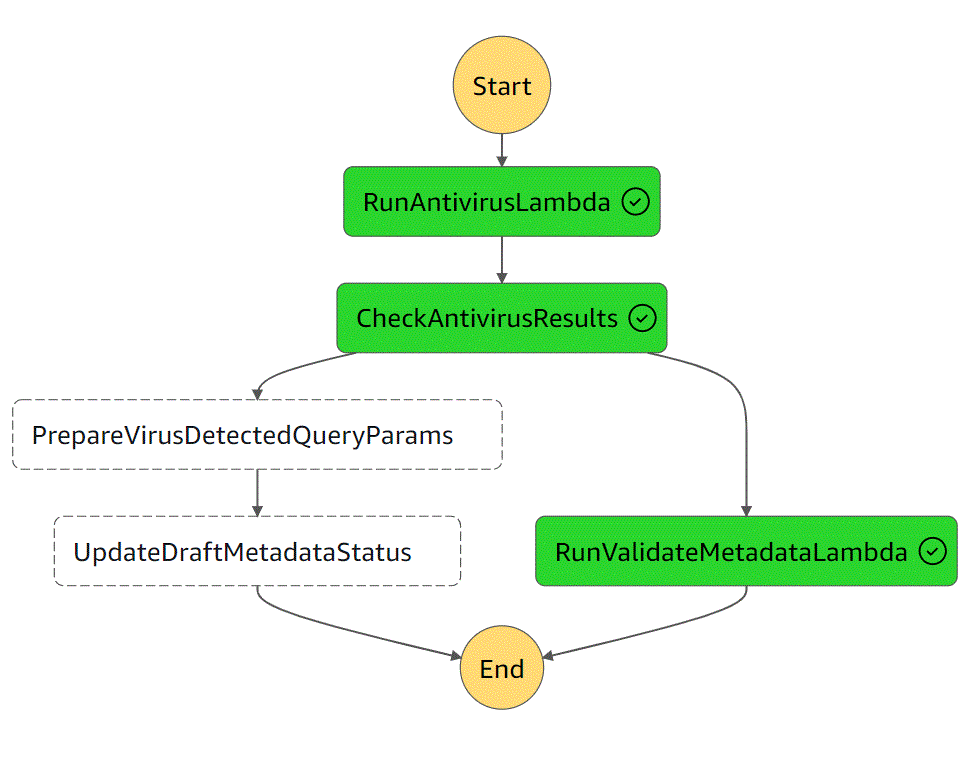

# tdr-draft-metadata-validator

The tdr-draft-metadata-validator is a Lambda that is invoked with a consignment ID from the tdrMetadataChecks step function




```
// validates, saves metadata, updates consignment status - the response value is not used by the step function
def handleRequest(input: java.util.Map[String, Object], context: Context): APIGatewayProxyResponseEvent = {
    val consignmentId = extractConsignmentId(input)
    val schemaToValidate: Set[JsonSchemaDefinition] = Set(BASE_SCHEMA, CLOSURE_SCHEMA)
    val s3Files = S3Files(S3Utils(s3Async(s3Endpoint)))
    val draftMetadata = DraftMetadata(UUID.fromString(consignmentId))
    val unexpectedFailureResponse = new APIGatewayProxyResponseEvent()
    unexpectedFailureResponse.setStatusCode(500)

    val requestHandler: IO[APIGatewayProxyResponseEvent] = for {
      errorFileData <- doValidation(draftMetadata,schemaToValidate)  
      errorFilePath <- IO(writeErrorFileDataToFile(draftMetadata, Right(errorFileData)))  // save the error file locally
      _ <- s3Files.uploadFile(bucket, s"${draftMetadata.consignmentId}/$errorFileName", errorFilePath) // upload error file to s3
      _ <- if(errorFileData.validationErrors.isEmpty) persistMetadata(draftMetadata) // if no errors persist metadata to DB
      statusCode <- updateStatus(errorFileData, draftMetadata) // update the consignment status 
    } yield {  
      val response = new APIGatewayProxyResponseEvent()
      response.setStatusCode(statusCode)
      response
    }
    // let's stop blowing up on unexpected errors but should log
    requestHandler.handleErrorWith(_ => IO(unexpectedFailureResponse)).unsafeRunSync()(cats.effect.unsafe.implicits.global)
  }

  // The validation involves several processes. When one fails furthur validation processes will not be tried
  // Probably best way to handle this is to raise the error and handle error at end to return the error so furthur processing can take plac
  // writing error file, updating status etc
  private def doValidation(draftMetadata: DraftMetadata, schemaToValidate: Set[JsonSchemaDefinition]):IO[ErrorFileData] = {
    ( for {
      _ <- s3Files.downloadFile(bucket, draftMetadata)
      _ <-  validUTF(draftMetadata)
      _ <-  validCSV(draftMetadata)
      csvData <- loadCSVData(draftMetadata: DraftMetadata)
      // do other validations using same pattern  
      _ <-  validateRequired(csvData,draftMetadata.consignmentId.toString)
      errorFile  <- validateMetadata(draftMetadata,csvData,schemaToValidate)
    } yield errorFile).handleErrorWith {
      case validationError:ValidationError => IO.pure(validationError.errorData)
      case _:Throwable =>  IO.pure(ErrorFileData(draftMetadata)) // with useful error data
    }
  }

  // for validation
  // validate required columns using a schema
  private def validateRequired(csvData: List[FileRow], consignmentID: String):IO[Unit] = ??? // IO.raiseError(new ValidationError(ErrorFileData with requiredErrors)
  private def validUTF(draftMetadata: DraftMetadata): IO[Unit] = ??? // IO.raiseError(new ValidationError(ErrorFileData with validUTF error)
  private def validCSV(draftMetadata: DraftMetadata):IO[Unit] = ???  // IO.raiseError(new ValidationError(ErrorFileData with validCSV error)
  private def loadCSVData(draftMetadata: DraftMetadata) :IO[List[FileRow]] = ??? // IO.raiseError(new ValidationError(ErrorFileData with validCSV error)
  // validate using schema
  private def validateMetadata(draftMetadata: DraftMetadata, csvData: List[FileRow], schema: Set[JsonSchemaDefinition]): IO[ErrorFileData] = ???  // not raising error here

  case class ValidationError(errorData:ErrorFileData ) extends Throwable
  private def updateStatus(errorFileData: ErrorFileData, draftMetadata: DraftMetadata):IO[Int] = ???
```


# Lambda Function: Metadata Validation and Processing

This AWS Lambda function processes consignment metadata by validating and uploading the metadata to AWS S3, performing schema validation, and updating the consignment status. The function is written using **Scala** and **cats-effect IO** for functional programming and side-effect handling.

## Table of Contents
- [Lambda Function Overview](#lambda-function-overview)
- [Validation Process](#validation-process)
- [Error Handling](#error-handling)
- [Helper Functions](#helper-functions)
- [Class: ValidationError](#class-validationerror)
- [Summary](#summary)

## Lambda Function Overview

The `handleRequest` function is the main entry point for handling a request. It processes metadata for a consignment by downloading a CSV file, performing several validations, and updating the status of the consignment. The result is an API Gateway response indicating success or failure.

### Parameters:
- **`input: java.util.Map[String, Object]`**: 
  - Contains the Lambda event parameters, including the consignment ID used to identify the metadata file.
  
- **`context: Context`**:
  - AWS Lambda context object, which provides information about the execution environment.

### Return Type:
- **`APIGatewayProxyResponseEvent`**: 
  - The function returns an API Gateway response event, which contains the status code indicating the success or failure of the request processing.

### Process Breakdown:

1. **Extracting the Consignment ID**:
   - The consignment ID is extracted from the Lambda event input using `extractConsignmentId(input)`.

2. **S3 Interaction Setup**:
   - `S3Files` and `S3Utils` objects are initialized for downloading and uploading files from AWS S3.

3. **Validation Process**:
   - A set of JSON schemas (`schemaToValidate`) is defined for validating the metadata file.
   - The `doValidation` function performs the validation process, and if any step fails, it returns an `ErrorFileData` object with error information.

4. **Error File Handling**:
   - If validation fails, an error file is written locally and uploaded to S3.

5. **Persistence and Status Updates**:
   - If validation passes, the metadata is persisted to the database, and the status of the consignment is updated.

6. **Response Handling**:
   - The result of the process (success or failure) is returned as an `APIGatewayProxyResponseEvent` with the appropriate status code.
   - Unexpected errors are handled, and a 500 status code is returned in such cases.

---

## Validation Process

The `doValidation` function performs the series of validations on the `metadata.csv` file. It ensures the file follows the correct encoding, format, and schema. The validation process halts at the first encountered error, which is then handled and returned.

### Parameters:
- **`draftMetadata: DraftMetadata`**: 
  - The metadata object associated with the consignment.
  
- **`schemaToValidate: Set[JsonSchemaDefinition]`**: 
  - A set of JSON schemas used to validate the structure and content of the metadata file.

### Return Type:
- **`IO[ErrorFileData]`**: 
  - Returns the result of the validation as an `ErrorFileData` object, encapsulating any errors encountered during validation.

### Validation Steps:
1. **Download the file from S3** using `s3Files.downloadFile`.
2. **Validate the file's encoding as UTF-8** with `validUTF`.
3. **Check that the file is a valid CSV** using `validCSV`.
4. **Load the CSV data** into Scala objects using `loadCSVData`.
5. **Validate required columns** using `validateRequired`.
6. **Validate the CSV data against the schema** using `validateMetadata`.

---

## Error Handling

Errors during the validation or processing are handled using a custom error type called `ValidationError`. If an error occurs, it is caught, and a default error file (`ErrorFileData`) is returned.

### Class: `ValidationError`

#### Description:
The `ValidationError` class is used to capture and handle validation errors throughout the process. It extends `Throwable`, making it possible to raise validation-related exceptions during the process.

#### Fields:
- **`errorData: ErrorFileData`**: 
  - Encapsulates the information related to the validation error.

---

## Helper Functions

### `validateRequired`
- **Parameters**: 
  - `csvData: List[FileRow]`: The parsed CSV rows.
  - `consignmentID: String`: The ID of the consignment.
  
- **Description**: 
  - Validates that the required columns are present in the CSV file. If not, it raises a `ValidationError`.

### `validUTF`
- **Parameters**: 
  - `draftMetadata: DraftMetadata`.
  
- **Description**: 
  - Validates that the file is UTF-8 encoded. If not, it raises a `ValidationError`.

### `validCSV`
- **Parameters**: 
  - `draftMetadata: DraftMetadata`.
  
- **Description**: 
  - Ensures that the file is a valid CSV format. If not, it raises a `ValidationError`.

### `loadCSVData`
- **Parameters**: 
  - `draftMetadata: DraftMetadata`.
  
- **Description**: 
  - Loads the CSV data and converts it into a list of `FileRow` objects for further processing.

### `validateMetadata`
- **Parameters**: 
  - `draftMetadata: DraftMetadata`: The consignment metadata.
  - `csvData: List[FileRow]`: The parsed CSV data.
  - `schema: Set[JsonSchemaDefinition]`: The JSON schema used for validation.
  
- **Description**: 
  - Validates the metadata against the JSON schema. Returns `ErrorFileData` with any validation errors.

### `updateStatus`
- **Parameters**: 
  - `errorFileData: ErrorFileData`: The result of the validation.
  - `draftMetadata: DraftMetadata`: The consignment metadata.

- **Description**: 
  - Updates the status of the consignment based on the validation results and returns the appropriate HTTP status code.

---

## Summary

This Lambda function processes consignment metadata by performing a series of validation checks, including UTF-8 validation, CSV format validation, and schema validation. If errors occur, they are captured and written to an error file, which is uploaded to S3. Depending on the validation outcome, the consignment's status is updated, and an API Gateway response is returned.

